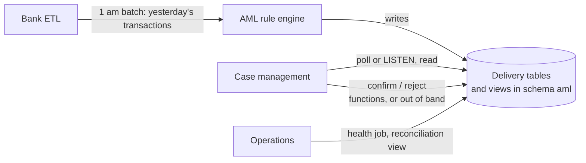
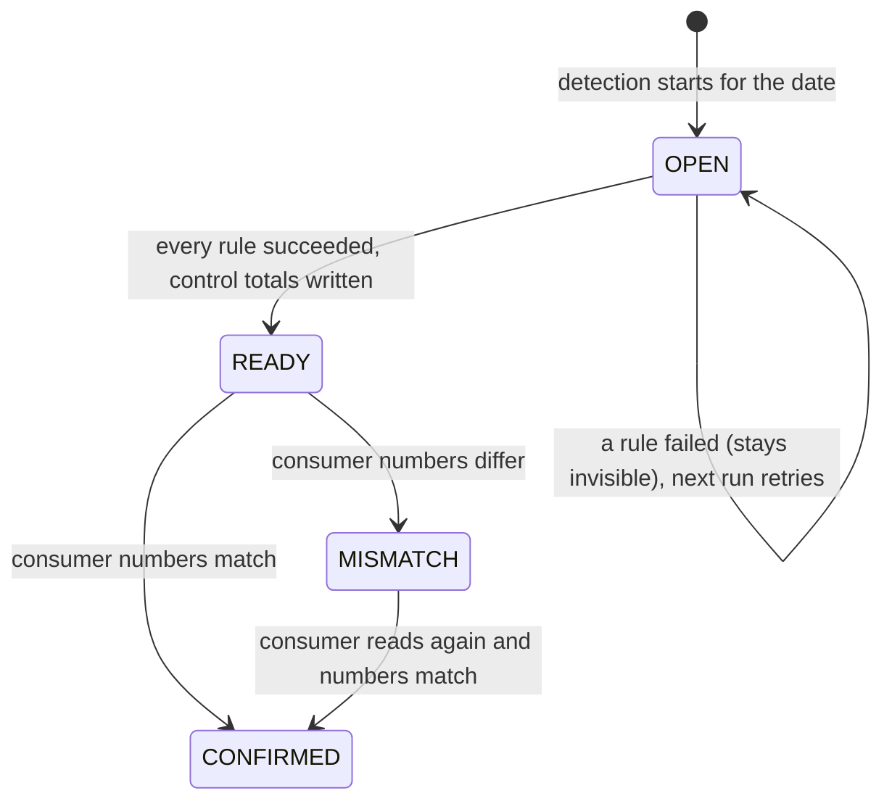
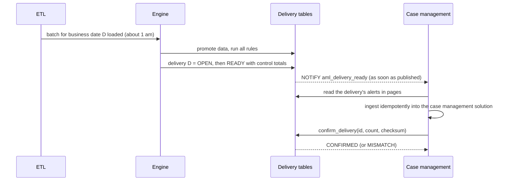
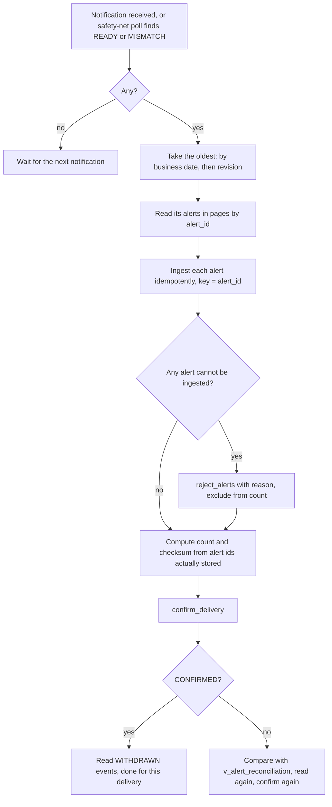
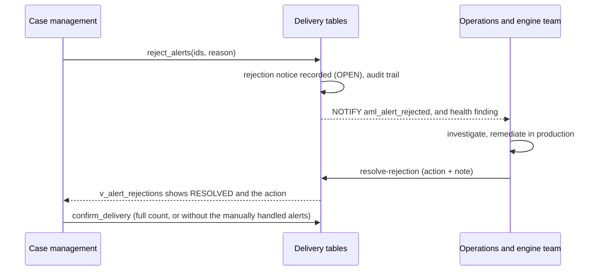
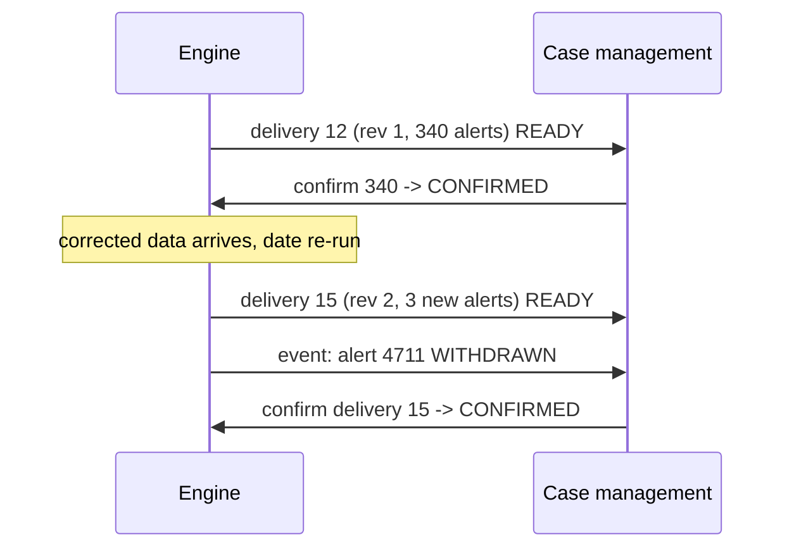

# Alert intake: how case management reads alerts and reconciles them

Functional and design document. Audience: the case management team, the AML detection engine team, operations and compliance.
Status: describes what the rule engine implements today. Items marked **Open** need a decision (section 15).

---

## 1. Purpose and scope

The AML rule engine detects suspicious activity on card, loan and deposit accounts every night and raises **alerts**. Case management (the "consumer") turns alerts into cases for investigation and, where warranted, SAR filing.

This document defines **how the consumer gets the alerts and proves it has all of them**:

- how it learns that alerts are available,
- how it reads them (the interface and the payload),
- how both sides reconcile counts and content,
- how corrections, rejections and failures are handled,
- who does what when something goes wrong.

Out of scope: how the consumer creates cases, assigns work or files SARs, and the detection rules themselves.

**Design principle:** alerts move in **one reconciled delivery per business date**, not one by one. Volume is small (roughly 300 to 5,000 alerts a day) and all of a day's alerts are created within minutes of each other, so the design optimises for completeness and proof, not throughput.

## 2. Context



| Actor | Responsibility |
|---|---|
| Rule engine | Detects, builds and publishes deliveries, freezes them, answers confirmations, reports health |
| Case management | Detects availability, reads, ingests idempotently, confirms or rejects, reports its own reconciliation |
| Operations | Watches health findings, chases unconfirmed or mismatched deliveries |
| Engine team | Fixes data or rule problems behind rejections and mismatches |

## 3. Key concepts

| Term | Meaning |
|---|---|
| **Business date** | The date of the nightly batch (for example 2026-10-01). It carries the transactions posted on the previous day (2026-09-30). Alerts carry the business date. |
| **Delivery** | The set of alerts for one business date, published together. Identified by `delivery_id`. |
| **Revision** | A date can have more than one delivery if a correction produces new alerts after publication: revision 1, 2, ... Published deliveries are never changed. |
| **Control totals** | Written by the engine when it publishes: alert count, count per rule, checksum. |
| **Checksum** | SHA-256, lowercase hex, of the delivery's alert ids sorted ascending and joined with commas (`101,102,250`). An empty delivery gives the SHA-256 of the empty string. |
| **Primary customer** | The alert is addressed to the primary party of the account. Joint owners are not modelled. |
| **WITHDRAWN event** | Tells the consumer that an alert it received would no longer be raised after a correction. The alert itself is never altered or deleted. |
| **Rejection notice** | The consumer tells the engine side that it could not ingest particular alerts, with a reason. It is recorded as an audit notice and followed up by operations until the production remediation is recorded (section 8). |

### Delivery status



- `OPEN` is invisible to the consumer: a half-built day is never exposed.
- A date with **no alerts** is still published (`READY`, count 0), so "nothing found" can be told apart from "not run yet".
- Alerts of a `READY` delivery stay visible until the delivery is `CONFIRMED`.

## 4. How alerts become available

### 4.1 Timeline of a normal night



There is **no fixed "ready by" time** for the consumer to wait for: case management is **notified as soon as the alerts for the business date have been produced and published**, and starts reading and ingesting at once. (For information: in the engine's 5-million-transaction test on a small server, not production, the promote and detection work took well under two minutes in total.)

### 4.2 Availability signals

| Signal | How | Notes |
|---|---|---|
| **Notification (primary)** | `LISTEN aml_delivery_ready;` The engine sends a JSON message as soon as a delivery is published: `{"delivery_id": 12, "business_date": "2026-10-01", "revision": 1, "alert_count": 340}`. The consumer reacts to it by reading and ingesting immediately. | Needs a long-lived database connection. A notification is **not durable**: it is lost if the listener is disconnected, which is why the safety net below exists. |
| **Poll (safety net)** | `SELECT ... FROM aml.v_alert_delivery WHERE status IN ('READY','MISMATCH')` | Run it at consumer start-up, after any reconnect, and on a slow timer (for example every 15 minutes) so that a missed notification is found. It is also how a consumer without a long-lived connection works on its own. |
| **Out of band** | Any other channel the two teams agree (message, e-mail, ticket) that tells the consumer a delivery is ready. | The consumer then reads exactly as in section 5. A relay that sends such a message from the delivery tables can be added without changing detection. |

## 5. Reading and ingesting: step by step



### 5.1 Find what is ready
```sql
SELECT delivery_id, business_date, revision, status, alert_count, rule_counts, checksum, ready_ts
FROM aml.v_alert_delivery
WHERE status IN ('READY', 'MISMATCH')
ORDER BY business_date, revision;
```

### 5.2 Read one delivery in pages
```sql
SELECT alert_id, payload
FROM aml.v_alert_export
WHERE delivery_id = :delivery_id AND alert_id > :last_seen_alert_id
ORDER BY alert_id
LIMIT 1000;
```
Page size 500 to 1,000. Keep the last `alert_id` of each page. The view only returns alerts of published deliveries that have not been confirmed, so a restart simply continues; re-reading an alert is always safe.

### 5.3 Ingest idempotently
Key everything on `alert_id`: inserting the same alert twice must not create two cases. The payload is self-contained (section 6); the consumer does not need to read any other engine table.

### 5.4 Confirm
Compute, from the alert ids **you actually stored for this delivery**:
- `count` = how many,
- `checksum` = SHA-256 (hex) of the ids sorted ascending, joined by commas. `SELECT aml.compute_alert_checksum(ARRAY[...]::bigint[])` returns the same value, so both sides can verify their implementation.

```sql
SELECT aml.confirm_delivery(:delivery_id, :count, :checksum);   -- 'CONFIRMED' or 'MISMATCH'
```
- **CONFIRMED**: the numbers equal the control totals. The engine marks every alert of the delivery as handed off; the delivery leaves the polling list. Repeating the same confirmation returns `CONFIRMED` again.
- **MISMATCH**: the engine records what you sent and leaves the alerts visible so you can read them again. Nothing is lost.

### 5.5 Reject what you cannot ingest
```sql
SELECT aml.reject_alerts(ARRAY[101, 102]::bigint[], 'customer C1 not found in case management');
```
A **reason is mandatory**. The call tells the rule engine side which alerts could not be ingested and why; it is recorded as an audit notice and operations are notified (section 8). Rejected alerts stay visible. Leave them out of the count you confirm with: the delivery then shows a mismatch, which keeps it open until the production remediation is recorded.

### 5.6 Read events (corrections)
```sql
SELECT event_id, alert_id, event_type, reason, created_ts, rule_code, account_id
FROM aml.v_alert_events
WHERE event_id > :last_processed_event_id
ORDER BY event_id;
```
Keep the highest `event_id` you processed. `WITHDRAWN` means a re-run on corrected data would no longer raise an alert you already received. The consumer decides what to do (typically flag the alert or case for review); the engine never edits or deletes a delivered alert.

## 6. Payload specification

`payload` (JSON) is the full alert. The scalar columns of `v_alert_export` (`alert_id`, `delivery_id`, `rule_code`, `business_date`, `account_id`, `customer_id`, `product_type`, `created_ts`) duplicate its key fields for filtering.

| Field | Meaning |
|---|---|
| `alert_id` | Unique, never reused. The idempotency key. |
| `business_date`, `summary` | Date raised for; the rule's name |
| `delivery.id`, `delivery.revision` | Which delivery it belongs to |
| `rule.code`, `rule.name`, `rule.version` | The rule that fired and its version at that time |
| `account.id`, `account.product_type` | The account (`CARD`, `LOAN`, `DEPOSIT`) |
| `customer.id` | The account's primary customer: the party the alert is about |
| `customer.name`, `.type`, `.country`, `.state` | **Snapshot taken when the alert was created**; later customer changes do not alter it |
| `evidence` | Rule-specific facts: totals, counts, window, thresholds, ratios, new values. Always holds the true totals |
| `transactions` | The transactions behind the alert (id, posting date, time, type, direction, amount, currency, channel, counterparty name and country). **Capped at 200 per alert**; use `evidence` for the full totals |

Example:
```json
{
  "alert_id": 4711, "business_date": "2026-10-01", "summary": "Large cash activity in one day",
  "delivery": {"id": 12, "revision": 1},
  "rule": {"code": "LARGE_CASH_DAILY", "name": "Large cash activity in one day", "version": 1},
  "account": {"id": "A1", "product_type": "DEPOSIT"},
  "customer": {"id": "C1", "name": "Ada Lovelace", "type": "INDIVIDUAL", "country": "US", "state": "NY"},
  "evidence": {"window_days": 1, "txn_count": 2, "total": 11000.0000, "min_sum": 10000.01, "min_count": 1},
  "transactions": [
    {"transaction_id": "T1", "posting_date": "2026-09-30", "txn_ts": "2026-09-30T10:15:00", "txn_type": "CASH_DEPOSIT",
     "direction": "CREDIT", "amount": 6000.0000, "currency": "USD", "channel": null,
     "counterparty_name": null, "counterparty_country": null}
  ]
}
```

## 7. Reconciliation

### 7.1 Three levels

| Level | Question | Who | How |
|---|---|---|---|
| **1. Delivery** | Did the consumer receive exactly the alerts the engine published? | Both, automatically | Count + checksum compared by `confirm_delivery` |
| **2. Alert** | Where does each alert stand? | Both | `v_alert_reconciliation` and `alert_rejection`: created, acknowledged, pending, rejected, withdrawn |
| **3. Daily** | Is every business date accounted for, with nothing stale? | Operations, daily | Reconciliation view for the last days plus the `health` job |

The consumer should keep its **own** record per delivery (id, count, checksum, time confirmed) so that either side can show the other its figures.

### 7.2 What the engine shows: `aml.v_alert_reconciliation`
One row per published delivery:

| Column | Meaning |
|---|---|
| `expected_count`, `checksum` | Control totals written at publication |
| `created_alerts` | Alerts actually belonging to the delivery (should equal `expected_count`) |
| `acknowledged_alerts` / `pending_alerts` | Handed off / still waiting |
| `rejected_unresolved` | Alerts the consumer rejected that are not yet resolved |
| `withdrawn_alerts` | Alerts of this delivery later withdrawn |
| `received_count`, `received_checksum` | What the consumer reported |
| `hours_unconfirmed` | Hours since publication while not confirmed |
| `confirmation_channel`, `confirmation_reference` | `DB` (function), `OPERATOR` (out-of-band job) or `FILE` (confirmation file), plus the ticket or message reference |
| `excluded_count` | Alerts left out of the control totals because they were handled manually (section 8) |

```sql
SELECT * FROM aml.v_alert_reconciliation
WHERE business_date >= CURRENT_DATE - 7
ORDER BY business_date DESC, revision DESC;
```

### 7.3 A healthy day looks like
`status = CONFIRMED`, `expected_count = created_alerts = received_count`, `checksum = received_checksum`, `pending_alerts = 0`, `rejected_unresolved = 0`.

### 7.4 When it does not reconcile

| Situation | What the numbers show | Action |
|---|---|---|
| Consumer missed alerts | `received_count` below `expected_count` | Read the delivery again (still visible), ingest the rest, confirm again |
| Consumer loaded some twice | `received_count` above expected | Fix the duplicate; idempotent ingest keyed on `alert_id` prevents it |
| Same count, different checksum | Different alerts than published | Compare id lists with the engine team |
| Consumer rejected alerts | Count below expected, a rejection notice with the reason | Operations and the engine team remediate in production and record it (section 8): either the cause is fixed and the consumer re-reads and confirms the full count, or the alerts are handled manually and the delivery closes without them |
| Delivery unconfirmed for too long | `hours_unconfirmed` high; health reports `DELIVERY_NOT_CONFIRMED` (default 12 hours) | Operations contacts the case management owner |
| Delivery stuck `MISMATCH` | Health reports `DELIVERY_MISMATCH` | Both sides compare the figures above |

## 8. Rejections and production remediation

When case management cannot ingest some alerts it **notifies the rule engine side with a reason**. This creates an audit record and a tracked, manual **production remediation**. The engine is a batch program with no always-on process, so the notification is: (1) a durable **rejection notice** (the audit record), (2) a database notification operations tooling can listen to, and (3) a **health finding** from the health job.



### 8.1 What is recorded (the audit trail)
One **rejection notice** per delivery involved in a call, in `aml.alert_rejection_notice`, readable through `aml.v_alert_rejections`; the rejected alerts are listed in `aml.v_alert_rejection_items`.

| Recorded | Meaning |
|---|---|
| Delivery, business date, alert count | What was rejected |
| Reason, rejected by, rejected at | Why, by which database user, when |
| Status `OPEN` / `RESOLVED` | Whether the remediation is done |
| Resolution action, note, resolved by, resolved at | What was done in production, by whom, when |
| Hours open | For notices still open |

Nothing is deleted: a rejection notice is a permanent audit record.

### 8.2 Notification to the engine side
- **Database notification** `aml_alert_rejected`, sent when the rejection is recorded: `{"notice_id": 5, "delivery_id": 12, "business_date": "2026-10-01", "alert_count": 3, "reason": "customer not found", "rejected_by": "case_mgmt"}`. Monitoring or paging tools can listen to it.
- **Health finding** `ALERT_REJECTED` for every open notice: a **warning** at first, **critical** once open longer than 24 hours (configurable). The health job runs from the scheduler and exits non-zero on critical findings.

### 8.3 Production remediation (manual)
Operations, with the engine team, investigate the reason and remediate in production, then record the outcome. Two outcomes exist:

| Action | Meaning | Effect on the delivery |
|---|---|---|
| `FIXED_REREAD` | The cause was fixed (for example the missing customer was loaded into case management). The alerts are still in the delivery. | None: the consumer re-reads the alerts and confirms the **full** count |
| `HANDLED_MANUALLY` | The alerts cannot be ingested and are handled outside the intake (for example a case opened by hand). | The alerts are **excluded from the delivery's control totals**, so a consumer that left them out can close the delivery. The number excluded is recorded on the delivery |

A **note describing the remediation is mandatory** (what was done, ticket reference). It is recorded with the database user and time:
```
FISRE_JOB=resolve-rejection  FISRE_REJECTION_ID=5  FISRE_RESOLUTION_ACTION=HANDLED_MANUALLY
FISRE_RESOLUTION_NOTE="accounts closed on 30 Sep; cases opened by hand, ticket CM-4421"   java -jar fisre-engine.jar
```
(or `SELECT aml.resolve_rejection(5, 'HANDLED_MANUALLY', 'accounts closed on 30 Sep; cases opened by hand, ticket CM-4421');`). A notice can be resolved once; invalid actions and empty notes are refused.

### 8.4 Worked example
Delivery 12 holds 340 alerts. The consumer ingests 337 and rejects 3 with the reason "customer not found". Confirming 337 gives `MISMATCH` (expected 340): the delivery stays open and visible, a notice (5) is recorded, operations are notified.

- **Case A, fixable:** operations loads the missing customers and records `FIXED_REREAD`. The consumer re-reads the 3 alerts, ingests them, and confirms 340: `CONFIRMED`.
- **Case B, not fixable:** the 3 accounts were closed and the cases will be opened by hand. Operations records `HANDLED_MANUALLY`. The delivery's effective expected totals are now 337 alerts and the checksum of those 337, so the consumer's confirmation of 337 gives `CONFIRMED`. The delivery shows `excluded_count = 3`, and the note and ticket explain why.

In both cases the sequence of who did what and when is in `v_alert_rejections` and `v_alert_reconciliation`.

## 9. Confirmation when the consumer cannot call the function

If the consumer can only read, confirmation can arrive another way. The comparison is exactly the same; the result records how and why.

**One delivery, by an operator** (numbers received by message, ticket or e-mail):
```
FISRE_JOB=confirm-delivery  FISRE_DELIVERY_ID=12  FISRE_RECEIVED_COUNT=340
FISRE_RECEIVED_CHECKSUM=<hex>  FISRE_CONFIRM_REFERENCE=TICKET-4521   java -jar fisre-engine.jar
```
**Many, from a file** the consumer drops (one line per delivery; the header is optional; the reference column is optional and defaults to the file name):
```
delivery_id,received_count,received_checksum,reference
12,340,9b2c...e1,MSG-77
13,12,41af...09,MSG-78
```
```
FISRE_JOB=import-confirmations  FISRE_CONFIRM_FILE=/data/case-mgmt-confirmations.csv   java -jar fisre-engine.jar
```
Every line is applied and reported; a bad line (wrong numbers, unknown delivery, malformed) does not stop the others, but the job exits with an error so it is noticed. A reference is **required** for audit: it is stored with the confirmation (`OPERATOR` or `FILE`). A mismatch is not recorded as a confirmation.

## 10. Corrections after publication

A published delivery is frozen. If data is corrected and the date is processed again:
- **New alerts** that were not raised before become **revision 2** of that date (a new delivery, with its own control totals, to be read and confirmed like any other).
- **Alerts that would no longer be raised** are reported as `WITHDRAWN` events; the alerts stay in the delivery as handed over.
- **Nothing changes** if the re-run produces nothing new: no new revision, no events.
- Evidence of an existing alert is not extended: alerts are what the consumer received.



## 11. Failure and edge cases

| Case | What happens | Consumer action |
|---|---|---|
| A rule fails during the night | The delivery stays `OPEN`; nothing is visible; health reports `RULE_FAILED` | Wait. The engine team fixes the rule and re-runs; the same delivery is then published |
| The nightly job has not finished | No delivery for the date | Keep polling; operations see `NIGHTLY_INCOMPLETE` / `DELIVERY_NOT_PUBLISHED` |
| A feed arrives truncated | The engine rejects the batch (volume check `VOL-001`); nothing is published for that date until the feed is fixed | Wait |
| A day has no alerts | `READY` with count 0 and the empty-string checksum | Confirm with count 0 and that checksum |
| Consumer is down for days | Deliveries accumulate, each `READY` | Ingest oldest first, confirm each |
| Consumer crashed mid-ingest | Nothing was confirmed; alerts remain visible | Restart; idempotent ingest makes re-reading safe |
| The same delivery is confirmed twice | Same numbers: `CONFIRMED` again; different numbers: error | None |
| Notification missed | None needed | The poll finds it |
| Engine restored from backup | Deliveries after the restore point may be gone or rebuilt | Operations compares `v_alert_reconciliation` with the consumer's own record and agrees what is re-sent |

## 12. Operations and ownership

| Event | Detected by | Owner |
|---|---|---|
| Delivery not published by the agreed time | `health` (`DELIVERY_NOT_PUBLISHED`), run after the nightly job | Engine operations |
| Delivery unconfirmed beyond the limit | `health` (`DELIVERY_NOT_CONFIRMED`, default 12 h) | Engine operations contacts case management |
| Mismatch | `health` (`DELIVERY_MISMATCH`) | Both sides, led by the case management owner |
| Rejected alerts | `aml_alert_rejected` notification, `health` (`ALERT_REJECTED`: warning, critical after 24 h), `v_alert_rejections` | Operations with the engine team remediate in production and record it with `resolve-rejection` |
| Withdrawn events | `v_alert_events` | Case management reviews affected alerts |

The health job exits non-zero on critical findings, so a scheduler can alert on it. Dashboards can use `v_alert_reconciliation`, `v_ops_alert_backlog` and `v_ops_failures`.

## 13. Security and access

The consumer's database user needs **only**:
- `SELECT` on `aml.v_alert_delivery`, `aml.v_alert_export`, `aml.v_alert_events`, `aml.v_alert_reconciliation`, `aml.v_alert_rejections`, `aml.v_alert_rejection_items` (so the consumer can see the status of its own rejections);
- `EXECUTE` on `aml.confirm_delivery`, `aml.reject_alerts`, `aml.compute_alert_checksum` (and optionally `aml.ack_alerts`).

It gets no access to any engine table. The script is `ops/db/postgresql/case_mgmt_grants.sql`. The payload contains customer names and transaction details: access to the views must be limited accordingly and every call is attributable (the database user is recorded on confirmations and rejections). Once an alert is handed off it cannot be changed or deleted by the engine (database trigger); a purge after the retention period is a documented, change-controlled procedure. If the consumer can only read, section 9 covers confirmation without any write access.

## 14. Non-functional notes

- **Volume:** 300 to 5,000 alerts a day; at most about 200 transactions in each alert's list, so a payload is small. Page size 500 to 1,000.
- **Idempotency:** every read is repeatable; every write the consumer makes (confirm, reject) is safe to repeat.
- **Ordering:** read deliveries oldest first by business date, then revision.
- **Retention:** how long the engine keeps delivered alerts is **Open** (compliance); the structures support purge under change control.
- **Time zone:** timestamps are database local time; the business date is a calendar date.

## 15. Open decisions

| # | Decision | Suggested default |
|---|---|---|
| 1 | Can the consumer keep a long-lived database connection to receive notifications? If not, which out-of-band signal replaces them? | Notification as the primary signal plus a 15-minute safety-net poll |
| 2 | Confirmation method: function call, out-of-band job, or file drop? | Function call if write access is acceptable; file drop otherwise |
| 3 | When does operations treat a missing delivery as an incident (the time the health job runs after the nightly job)? No consumer wait time is needed, because the consumer is notified immediately | Set by operations once the real nightly duration is known |
| 4 | Time allowed before an unconfirmed delivery is escalated | 12 hours (configurable) |
| 5 | Which team performs production remediation of rejected alerts, and what is the escalation if a notice stays open beyond 24 hours | Operations with the engine team; the 24-hour limit is configurable |
| 6 | Treatment of `WITHDRAWN` alerts in case management (flag, close, review) | Flag for analyst review; never delete the case automatically |
| 7 | How long delivered alerts are kept | Per compliance policy, at least the SAR retention period |
| 8 | Whether the consumer needs a second consumer-side copy of reconciliation figures sent back to operations (for example a daily e-mail) | Consumer keeps its own record; operations compares on request |

## 16. Acceptance checklist for the case management side

Case management should demonstrate, against a test environment fed by the engine:

1. Receives the `aml_delivery_ready` notification and starts reading at once; finds the same delivery by the safety-net poll if the notification is missed.
2. Reads all alerts of a delivery in pages and stores each exactly once, keyed by `alert_id`.
3. Computes the same checksum as `compute_alert_checksum` for a delivery and gets `CONFIRMED`.
4. Re-reads a delivery after a simulated crash without duplicating anything.
5. Confirms a zero-alert delivery (count 0, empty-string checksum).
6. Deliberately sends a wrong count and sees `MISMATCH`, then recovers with the right one.
7. Rejects an alert with a reason, sees the rejection notice in `v_alert_rejections`, and sees the delivery stay open (`MISMATCH`).
7a. After operations records `FIXED_REREAD`, re-reads and confirms the full count; after `HANDLED_MANUALLY`, confirms without the excluded alerts.
8. Processes a revision 2 delivery and a `WITHDRAWN` event.
9. (If using out-of-band confirmation) Delivers a confirmation file and sees `FILE` and the reference recorded.
10. Produces its own per-delivery reconciliation record that matches `v_alert_reconciliation`.

## 17. Glossary

**Alert**: a detection result for one account, one rule, one business date. **Business date**: the date of the nightly batch. **Control totals**: count, per-rule counts and checksum written at publication. **Delivery**: the alerts of one business date, published together. **Idempotent**: safe to repeat with the same result. **Rejection notice**: the audit record of alerts the consumer could not ingest, and of the remediation. **Revision**: a further delivery for a date after a correction. **Withdrawn**: an alert that a corrected re-run no longer produces.

## 18. References

- Contract details and exact column lists: `specs/data-contract/alert-export.md`
- Requirements: `specs/requirements/delivery.md`, `handoff.md`
- Design rationale: ADR-0006, ADR-0008 in `specs/adr/`
- Rejections: `specs/requirements/rejection.md`
- Operations: `ops/RUNBOOK.md`; access script: `ops/db/postgresql/case_mgmt_grants.sql`
