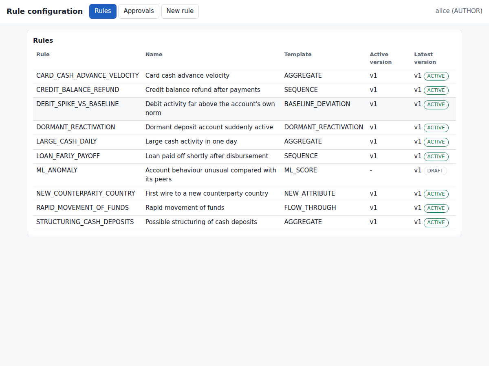
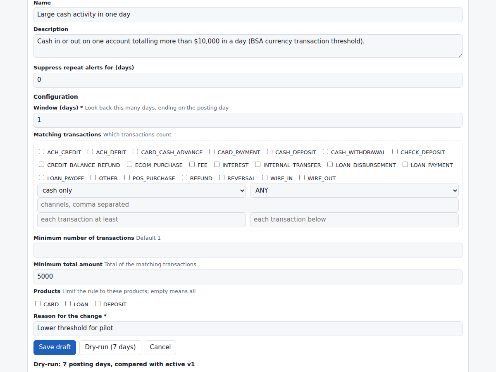
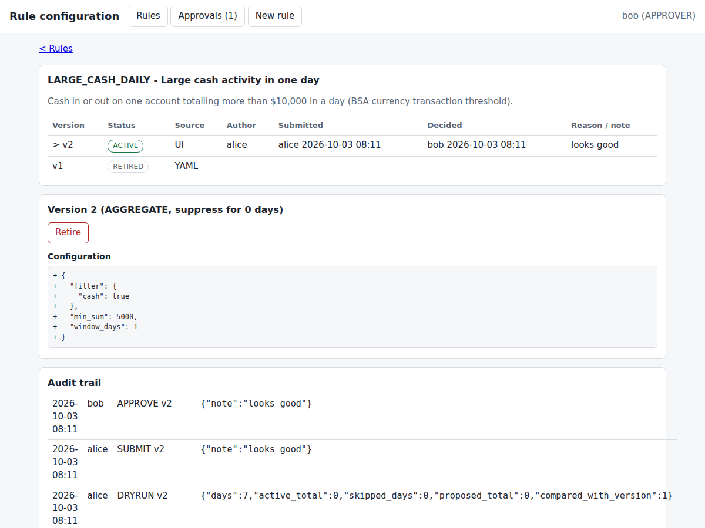

# Rule configuration UI: user guide

For compliance analysts (authors) and approvers. Design: ADR-0010. Start-up and users: README, "Rule configuration UI".

## Roles

| Role | Can |
|---|---|
| Viewer | See rules, versions, audit trail |
| Author | Everything a viewer can, plus create and edit drafts, submit them, run dry-runs |
| Approver | Everything a viewer can, plus approve, reject and retire. **Never the person who submitted the version.** |

## Changing a rule

1. Open the rule, choose **New version from vN** (or **New rule** for a new one). The form lists exactly the settings that rule type accepts; unknown or invalid values are refused on save.
2. Enter the **reason** for the change (kept in the audit trail) and **Save draft**.
3. Run a **Dry-run (7 days)**: it replays your draft over the most recent posting days and shows alerts per day next to the current version (added, removed) plus a sample of hits. It saves nothing and raises no alerts. A version cannot be approved without a dry-run made after its last edit.
4. **Submit for approval.** The draft is now locked.
5. An approver reviews the configuration (changes against the active version are highlighted), then **Approve** or **Reject** (a reason is mandatory). Approval makes it the active version and retires the previous one in the same step. It applies from the next detection run.

## Good to know

* A rule has at most one draft or pending version at a time.
* A rejected or retired version is never edited; start a new version.
* The dry-run ignores "suppress repeat alerts" and counts back from the latest posting day in the data.
* `ML_ANOMALY` goes live the same way: approve a version of it (it ships as a draft in shadow mode).
* Every step, with who and when, is under **Audit trail** and cannot be edited.
